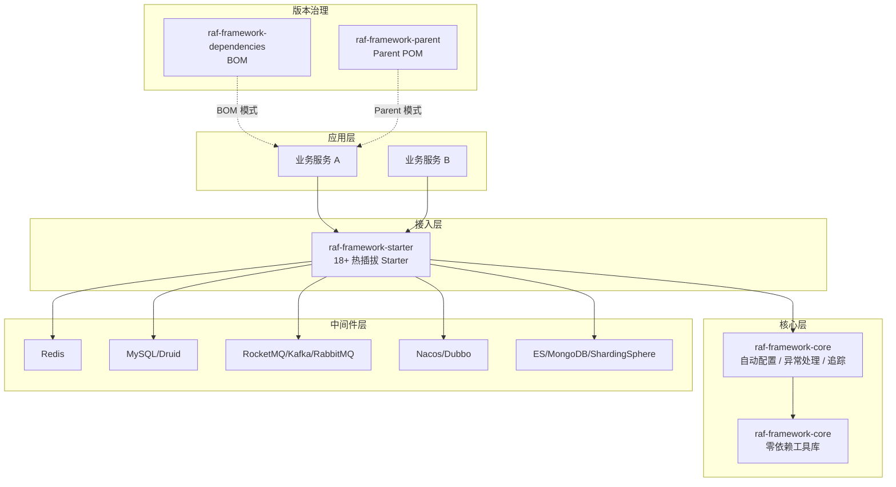

# GitHub 开源完善 Implementation Plan

> **For agentic workers:** REQUIRED SUB-SKILL: Use superpowers:subagent-driven-development (recommended) or superpowers:executing-plans to implement this plan task-by-task. Steps use checkbox (`- [ ]`) syntax for tracking.

**Goal:** 将 raf-framework 补全至高质量国内开源项目标准，覆盖第一印象、上手体验、社区运营三个层次。

**Architecture:** 纯文档与配置层面改动，不涉及框架 Java 代码。改动分四个优先级批次（P0→P3）独立推进，每个任务产出可独立提交的变更。

**Tech Stack:** Markdown、Mermaid（GitHub 原生渲染）、VitePress、YAML、`.editorconfig`

---

## 文件清单

| 操作 | 文件路径 | 说明 |
|---|---|---|
| Modify | `README.md` | 加定位段落、Mermaid 架构图、对比表、文档 badge、Discussions 引导 |
| Modify | `.github/workflows/ci.yml` | 统一 PR 触发分支为 master |
| Create | `docs-site/components/web.md` | web-starter 文档 |
| Create | `docs-site/components/redis.md` | redis-starter 文档 |
| Create | `docs-site/components/mybatis.md` | mybatis-starter 文档 |
| Create | `docs-site/components/datasource.md` | datasource-starter 文档 |
| Create | `docs-site/components/rabbit.md` | rabbit-starter 文档 |
| Create | `docs-site/components/rocketmq.md` | rocketmq-starter 文档 |
| Create | `docs-site/components/kafka.md` | kafka-starter 文档 |
| Create | `docs-site/components/dubbo.md` | dubbo-starter 文档 |
| Create | `docs-site/components/nacos-config.md` | nacos-config-starter 文档 |
| Create | `docs-site/components/nacos-discovery.md` | nacos-discovery-starter 文档 |
| Create | `docs-site/components/gateway.md` | gateway-starter 文档 |
| Create | `docs-site/components/mongodb.md` | mongodb-starter 文档 |
| Create | `docs-site/components/elasticsearch.md` | elasticsearch-starter 文档 |
| Create | `docs-site/components/shardingsphere.md` | shardingsphere-starter 文档 |
| Create | `docs-site/components/okhttp.md` | okhttp-starter 文档 |
| Create | `docs-site/components/openapi.md` | openapi-starter 文档 |
| Create | `docs-site/components/monitor.md` | monitor-starter 文档 |
| Create | `docs-site/components/sentry.md` | sentry-starter 文档 |
| Create | `docs-site/guide/faq.md` | 常见问题 |
| Create | `docs-site/guide/upgrade.md` | 版本升级指南 |
| Modify | `docs-site/.vitepress/config.ts` | 侧边栏加入所有新页面 |
| Create | `examples/raf-example-basic/README.md` | 示例 README |
| Create | `examples/raf-example-redis/README.md` | 示例 README |
| Create | `examples/raf-example-dubbo/README.md` | 示例 README |
| Create | `examples/raf-example-distributed-tx/README.md` | 示例 README |
| Create | `examples/raf-example-full-stack/README.md` | 示例 README |
| Modify | `CONTRIBUTING.md` | 新增四章节 |
| Create | `.github/dev/docker-compose.yml` | 本地开发中间件 |
| Create | `.editorconfig` | 编码规范 |

---

## Task 1: P0 — CI 分支名修复

**Files:**
- Modify: `.github/workflows/ci.yml`

- [ ] **Step 1: 修改 PR 触发分支**

将 `ci.yml` 中 `pull_request` 的 `branches` 从 `[main, master]` 改为 `[master]`：

```yaml
on:
  push:
    branches:
      - "master"
    paths:
      - "raf-framework-core/**"
      - "raf-framework-starter/**"
      - "raf-framework-dependencies/**"
      - "raf-framework-parent/**"
  pull_request:
    branches:
      - "master"
```

- [ ] **Step 2: 提交**

```bash
git add .github/workflows/ci.yml
git commit -m "ci: unify PR trigger branch to master"
```

---

## Task 2: P0 — README 重构

**Files:**
- Modify: `README.md`

- [ ] **Step 1: 在 badge 区下方、第一个 `##` 标题之前插入定位说明段落**

在 README.md 中找到第一个 `## ` 标题行，在其前面插入：

```markdown
> **raf-framework 不是另一个脚手架，而是一个"中间件接入层"。**
> 它解决的问题是：每个微服务项目都要重复写 Redis 配置、MQ 消费者、多数据源路由、全局异常处理……
> raf-framework 把这些横切关注点封装成热插拔 Starter，**引入依赖即生效，不引入零侵入**。

```

- [ ] **Step 2: 在简介章节后插入 Mermaid 架构图**

在 `## 简介` 或 `## 特性` 章节末尾追加：

```markdown
## 架构概览


```

- [ ] **Step 3: 在快速开始章节后插入对比表**

在 `## 快速开始` 章节末尾追加：

```markdown
## 与同类方案对比

| 对比维度 | raf-framework | 纯 Spring Boot 脚手架 | JHipster |
|---|---|---|---|
| 接入方式 | BOM / Parent 双模式 | 复制粘贴 | 代码生成 |
| 中间件覆盖 | 18+ Starter | 按需手写 | 有限 |
| 侵入性 | 零侵入 | 高 | 高 |
| 升级成本 | 改一行版本号 | 逐文件修改 | 重新生成 |
```

- [ ] **Step 4: 在 badge 区新增文档站 badge**

在现有 badge 行末尾追加（与其他 badge 同行）：

```markdown
[](https://jerryraf.github.io/raf-framework/)
```

- [ ] **Step 5: 在贡献指南章节前插入 Discussions 引导**

在 `## 贡献` 或 `## Contributing` 章节前插入：

```markdown
## 遇到问题？

| 场景 | 去哪里 |
|---|---|
| 使用问题、配置疑惑 | [GitHub Discussions](https://github.com/JerryRaf/raf-framework/discussions) |
| 发现 Bug | [GitHub Issues（Bug Report）](https://github.com/JerryRaf/raf-framework/issues/new?template=bug_report.md) |
| 功能建议 | [GitHub Issues（Feature Request）](https://github.com/JerryRaf/raf-framework/issues/new?template=feature_request.md) |
```

- [ ] **Step 6: 提交**

```bash
git add README.md
git commit -m "docs: restructure README with positioning, architecture diagram and comparison table"
```

---

## Task 3: P1 — 文档站（web-starter）

**Files:**
- Create: `docs-site/components/web.md`

- [ ] **Step 1: 创建文件，内容如下**

````markdown
# Web 基础（web-starter）

## 功能概述

`raf-framework-web-starter` 是所有 Web 服务的基础 Starter，提供：

- **统一响应封装**：`@ResponseResult` 注解自动包装返回值为 `RafResult<T>`
- **全局异常处理**：四层异常体系（Business / Infrastructure / System / Protocol）
- **HTTP 请求日志**：可配置的访问日志级别（OFF → RSP_BODY）
- **CORS 跨域**：统一跨域配置
- **API 版本路由**：`@ApiVersion` 注解支持 URL 版本路由
- **异步线程池**：多线程池配置，自动传播 traceId

## 配置项

### 请求日志（raf.log）

| 配置键 | 类型 | 默认值 | 说明 |
|---|---|---|---|
| `raf.log.level` | enum | `RSP_HEADERS` | 日志级别：OFF / BASIC / REQ_HEADERS / REQ_BODY / RSP_HEADERS / RSP_BODY |

### CORS 跨域（raf.cors）

| 配置键 | 类型 | 默认值 | 说明 |
|---|---|---|---|
| `raf.cors.enabled` | boolean | `false` | 是否启用跨域 |
| `raf.cors.path` | string | — | 跨域路径，如 `/**` |
| `raf.cors.allowOrigins` | list | `["*"]` | 允许的来源 |
| `raf.cors.allowHeaders` | list | `["*"]` | 允许的请求头 |
| `raf.cors.allowMethods` | list | `["*"]` | 允许的 HTTP 方法 |
| `raf.cors.allowExposeHeaders` | list | — | 暴露给前端的响应头 |

### 异步线程池（raf.async）

| 配置键 | 类型 | 默认值 | 说明 |
|---|---|---|---|
| `raf.async.enabled` | boolean | `false` | 是否启用多线程池 |
| `raf.async.pools.{name}.coreSize` | int | `10` | 核心线程数 |
| `raf.async.pools.{name}.maxSize` | int | `50` | 最大线程数 |
| `raf.async.pools.{name}.queueCapacity` | int | `100` | 队列容量 |
| `raf.async.pools.{name}.keepAliveSeconds` | int | `60` | 空闲线程存活时间（秒） |
| `raf.async.pools.{name}.threadNamePrefix` | string | `raf-async-` | 线程名前缀 |

## 快速接入

**1. 引入依赖**

```xml
<dependency>
    <groupId>io.github.jerryraf</groupId>
    <artifactId>raf-framework-web-starter</artifactId>
</dependency>
```

**2. 最小配置**（`application.yml`）

```yaml
raf:
  log:
    level: REQ_BODY   # 开发环境建议 REQ_BODY，生产环境建议 RSP_HEADERS
  cors:
    enabled: true
    path: /**
```

## 核心用法

### 统一响应封装

```java
@ResponseResult
@RestController
@RequestMapping("/api/user")
public class UserController {

    @GetMapping("/{id}")
    public User getUser(@PathVariable Long id) {
        return userService.getById(id);
        // 自动包装为 {"code":200,"msg":"成功！","data":{...}}
    }
}
```

### 异常使用规范

```java
// 业务异常（code >= 10000，HTTP 200，WARN 日志，无堆栈）
throw new BusinessException(10001, "用户不存在");

// 基础设施异常（第三方服务/数据库错误，HTTP 500）
throw new InfrastructureException("Redis 连接失败", e);

// 系统异常（未预期错误，HTTP 500，完整堆栈）
throw new SystemException("未知错误", e);

// 协议异常（认证失败，HTTP 401）
throw new ProtocolException("Token 已过期");
```

### API 版本路由

```java
@ApiVersion("v1")
@RestController
@RequestMapping("/api/user")
public class UserV1Controller { ... }

@ApiVersion("v2")
@RestController
@RequestMapping("/api/user")
public class UserV2Controller { ... }
// 访问 /v1/api/user 和 /v2/api/user 分别路由到不同 Controller
```

### 异步线程池

```yaml
raf:
  async:
    enabled: true
    pools:
      order:
        coreSize: 20
        maxSize: 100
        queueCapacity: 500
        threadNamePrefix: order-async-
```

```java
@Autowired
@Qualifier("orderThreadPoolTaskExecutor")
private ThreadPoolTaskExecutor orderExecutor;

// traceId 自动传播到子线程
orderExecutor.execute(() -> processOrder(orderId));
```

## 常见问题

**Q: `@ResponseResult` 不生效？**
A: 检查是否在 Controller 类或方法上加了注解。继承基类时注解需加在具体方法上。

**Q: 日志级别设置了 `REQ_BODY` 但看不到请求体？**
A: 框架使用 `ContentCachingRequestWrapper` 包装请求体，确保没有其他 Filter 提前消费了请求流。
````

- [ ] **Step 2: 提交**

```bash
git add docs-site/components/web.md
git commit -m "docs: add web-starter documentation"
```

---

## Task 4: P1 — 文档站（redis-starter）

**Files:**
- Create: `docs-site/components/redis.md`

- [ ] **Step 1: 创建文件，内容如下**

````markdown
# Redis 缓存与分布式锁（redis-starter）

## 功能概述

- **RedisService**：封装常用 Redis 操作（String、Hash、List、Set、ZSet、过期时间）
- **Redisson 分布式锁**：基于 RedissonService，支持单机和集群模式
- **自定义缓存 TTL**：通过 `raf.redis.customCache` 为不同 cacheName 配置独立 TTL
- **多级缓存**：MultiLevelCacheService 支持本地缓存 + Redis 二级缓存

## 配置项

### Redis 增强（raf.redis）

| 配置键 | 类型 | 默认值 | 说明 |
|---|---|---|---|
| `raf.redis.enabled` | boolean | `false` | 是否启用 Redis 增强功能 |
| `raf.redis.customCache.{name}.timeToLive` | Duration | — | 缓存 TTL，如 `30m`、`1h` |
| `raf.redis.customCache.{name}.cacheNullValues` | boolean | `true` | 是否缓存 null 值（防缓存穿透） |
| `raf.redis.customCache.{name}.keyPrefix` | string | — | Key 前缀 |
| `raf.redis.customCache.{name}.useKeyPrefix` | boolean | `true` | 是否使用 Key 前缀 |

### Redisson（raf.redisson）

| 配置键 | 类型 | 默认值 | 说明 |
|---|---|---|---|
| `raf.redisson.enabled` | boolean | `false` | 是否启用 Redisson |
| `raf.redisson.single.host` | string | — | 单机模式：Redis 主机 |
| `raf.redisson.single.port` | int | — | 单机模式：Redis 端口 |
| `raf.redisson.single.password` | string | — | 密码 |
| `raf.redisson.single.database` | int | — | 数据库编号 |
| `raf.redisson.cluster.nodes` | string | — | 集群节点地址，逗号分隔 |
| `raf.redisson.timeout` | int | `3000` | 命令等待超时（毫秒） |
| `raf.redisson.retryAttempts` | int | `3` | 失败重试次数 |
| `raf.redisson.threads` | int | CPU×2 | 内部线程池数量 |

## 快速接入

```xml
<dependency>
    <groupId>io.github.jerryraf</groupId>
    <artifactId>raf-framework-redis-starter</artifactId>
</dependency>
```

```yaml
spring:
  data:
    redis:
      host: 127.0.0.1
      port: 6379
      password: your_password
      database: 0

raf:
  redis:
    enabled: true
    customCache:
      userCache:
        timeToLive: 30m
        cacheNullValues: true
  redisson:
    enabled: true
    single:
      host: 127.0.0.1
      port: 6379
      password: your_password
      database: 0
```

## 核心用法

### RedisService

```java
@Autowired
private RedisService redisService;

// String 操作
redisService.set("key", "value", 30, TimeUnit.MINUTES);
String value = (String) redisService.get("key");

// Hash 操作
redisService.hSet("hashKey", "field", "value");
Object field = redisService.hGet("hashKey", "field");

// 原子计数
long count = redisService.incr("counter", 1);

// 删除
redisService.del("key");
```

### Redisson 分布式锁

```java
@Autowired
private RedissonService redissonService;

String lockKey = "order:lock:" + orderId;
RLock lock = redissonService.getLock(lockKey);

try {
    // 等待 3 秒，锁持有 30 秒后自动释放
    boolean locked = lock.tryLock(3, 30, TimeUnit.SECONDS);
    if (!locked) {
        throw new BusinessException(10002, "操作频繁，请稍后重试");
    }
    processOrder(orderId);
} finally {
    if (lock.isHeldByCurrentThread()) {
        lock.unlock();
    }
}
```

### 自定义缓存 TTL

```java
@Cacheable(cacheNames = "userCache", key = "#id")
public User getUserById(Long id) {
    return userMapper.selectById(id);
}
// userCache 的 TTL 由 raf.redis.customCache.userCache.timeToLive 控制
```

## 常见问题

**Q: Redisson 和 Spring Data Redis 可以同时使用吗？**
A: 可以。两者独立配置，互不干扰。

**Q: 分布式锁释放时报 `IllegalMonitorStateException`？**
A: 在 `finally` 块中先判断 `lock.isHeldByCurrentThread()` 再释放，避免锁超时后重复释放。

**Q: 自定义缓存 TTL 不生效？**
A: 确认 `raf.redis.enabled=true`，且 `@Cacheable` 的 `cacheNames` 与配置 key 完全一致（大小写敏感）。
````

- [ ] **Step 2: 提交**

```bash
git add docs-site/components/redis.md
git commit -m "docs: add redis-starter documentation"
```

---
